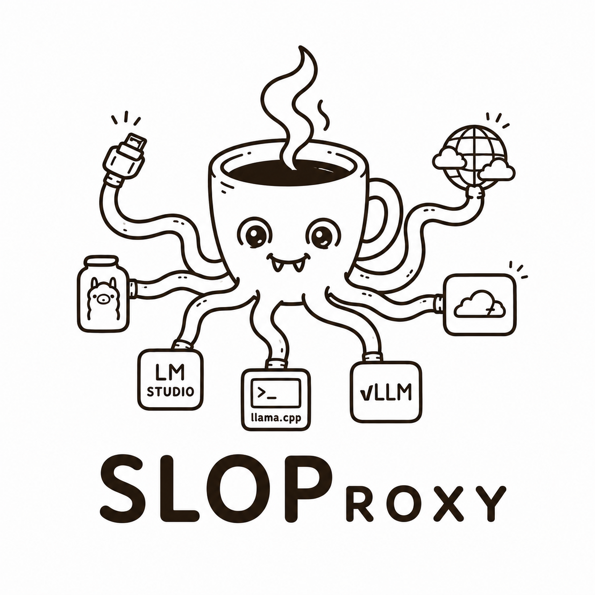

# SLOProxy

SLOProxy is the Single Local Origin Proxy: a small Node.js CLI for routing OpenAI-compatible inference requests to models running on your own machine.

It can front one or more localhost backends such as Ollama, LM Studio, llama.cpp, vLLM, or another OpenAI-compatible server. It can stay local-only, or expose the same local origin through Tailscale Funnel or Cloudflare Tunnel.

## Install

```bash
npm install -g sloproxy
```

Then initialize and run the proxy:

```bash
sloproxy init
sloproxy up
```

You can also run it without a global install:

```bash
npx sloproxy init
npx sloproxy up
```

## Commands

```bash
sloproxy up
sloproxy init
sloproxy install
sloproxy start
sloproxy stop
sloproxy status
sloproxy rotate-key
sloproxy uninstall
```

On macOS, `sloproxy install` writes a LaunchAgent at `~/Library/LaunchAgents/com.mattwiebe.sloproxy.plist` so the proxy can run in the background across logins.

## Configuration

Guided setup will:

- scan common localhost ports for OpenAI-compatible providers,
- ask for provider slugs and ports that were not detected,
- ask whether to run local-only, Tailscale Funnel, or Cloudflare Tunnel,
- generate or accept an API key for tunneled modes,
- save configuration to `~/.config/sloproxy/.env`.

The persisted `.env` uses this provider format:

```dotenv
PORT="13531"
TUNNEL_MODE="local"
PROVIDERS="ollama:11434,lmstudio:1234"
API_KEY=""
```

The running proxy watches its `.env` file and restarts itself when that file changes.

## Providers

Configured providers are exposed as one OpenAI-compatible endpoint. The proxy prefixes model IDs with the provider slug in `/v1/models`, for example `ollama/llama3.2` or `lmstudio/local-model`. Requests should send that prefixed model ID; SLOProxy strips the slug before forwarding to the matching local provider.

Provider slugs and ports must both be unique. If two providers use the same localhost port, startup fails with a configuration error instead of guessing which provider owns that port.

## Examples

```bash
sloproxy up --port 13531
sloproxy up --provider ollama:11434 --provider lmstudio:1234
sloproxy up --tunnel cloudflare
sloproxy up --tunnel tailscale
sloproxy up --funnel-port 10000
sloproxy up --backend http://localhost:11434
sloproxy up --api-key your-secret
sloproxy up --no-tunnel
```

## Development

```bash
npm ci
npm run lint
npm test
```

This project is independent from the WordPress plugin that recommends it.
